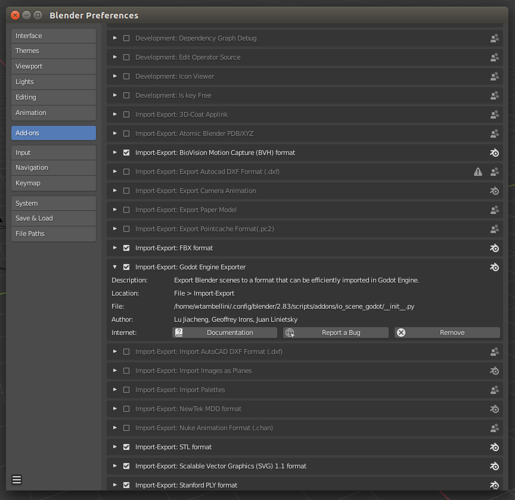

# Godot Engine's native Blender exporter add-on.

Native Godot scene format exporter for [Blender](https://www.blender.org), making the
export process to [Godot Engine](https://godotengine.org) as straightforward as possible.
___

**Warning:** This exporter is experimental, and still lacks many features.
If you need a full-featured import-export pipeline, consider using glTF 2.0 instead.
(The glTF 2.0 exporter is built into Blender.)

**Blender compatibility:** The current `master` branch requires at least Blender 2.80.

## Installation

1. Copy the `io_scene_godot` directory to the location where Blender stores the
   `scripts/addons` folder on your system. Copy the *entire* directory and not just its
   contents. For instance, on Linux, add-ons should be installed in
   `$HOME/.config/blender/<version>/scripts/addons` (create folders as needed).
   `<version>` should be replaced with your Blender version (such as `2.83`
   or `2.91` - don't include the letter or patch number if there is one).
   See [Blender directory layout](https://docs.blender.org/manual/en/latest/advanced/blender_directory_layout.html)
   for more information.
2. Go to the Blender settings and enable the "Godot Exporter" plugin.
   
3. Export your file with `File` -> `Export` -> `Godot Engine (.escn)`.

If you find bugs or want to suggest improvements, please open an issue on the
upstream [GitHub repository](https://github.com/godotengine/blender-exporter).

## Usage

See [the documentation](https://docs.godotengine.org/en/stable/getting_started/workflow/assets/escn_exporter/index.html)
included in the official Godot documentation.

## Development Notes

This repository includes a Makefile to assist with development. Running
`make` from the project root will:

1. Export all of the blend files from the `tests/scenes` directory.
   If you add a feature, it is suggested that you add a new blend file to
   the `tests/scenes` directory that uses this feature.
2. Runs `diff` on the output files compared to the reference exports. This acts
   as a regression test.
3. Runs [pycodestyle](http://pycodestyle.pycqa.org/en/latest/) and
   [pylint](https://www.pylint.org/) style tests. Your code must pass these to
   be elegible to merge.

Current regression tests use the daily build of Blender 2.8 from Blender [official
site](https://builder.blender.org/download/) and runs on ubuntu 16.04. To fix the
diff test failure:
   -  You can run a `make export-blends` followed by a `make update-examples` and commit the changes made to the [reference_exports](tests/reference_exports). However, if you are running on a platform different than the one used by the TravisCI, there is a small chance that regression won't be passing because of float rounding. Then you might need to look at the TravisCI log and fix the remaining issue by hand.
   - Or you can use the [update_scene_from_travis.sh](tests/update_scene_from_travis.sh) script, run it with the failing TravisCI job ID as the argument. The script will fetch the scene diffs from the Travis machine to your local git repository and apply it.

## Docker

The reference exports depend on a very specific version of Blender, and may
produce different results with your local blender version. A Dockerfile is
provided to help test and update examples:

To build:
```
sudo docker build . -t godot_blender_exporter:latest
```

To test:
```
docker run --volume `pwd`:/workdir godot_blender_exporter:latest compare
```

To update reference exports:
```
docker run --volume `pwd`:/workdir godot_blender_exporter:latest export-blends update-examples
```

## License

This Godot exporter is distributed under the terms of the GNU General
Public License, version 2 or later. See the [LICENSE.txt](/LICENSE.txt) file
for details.
